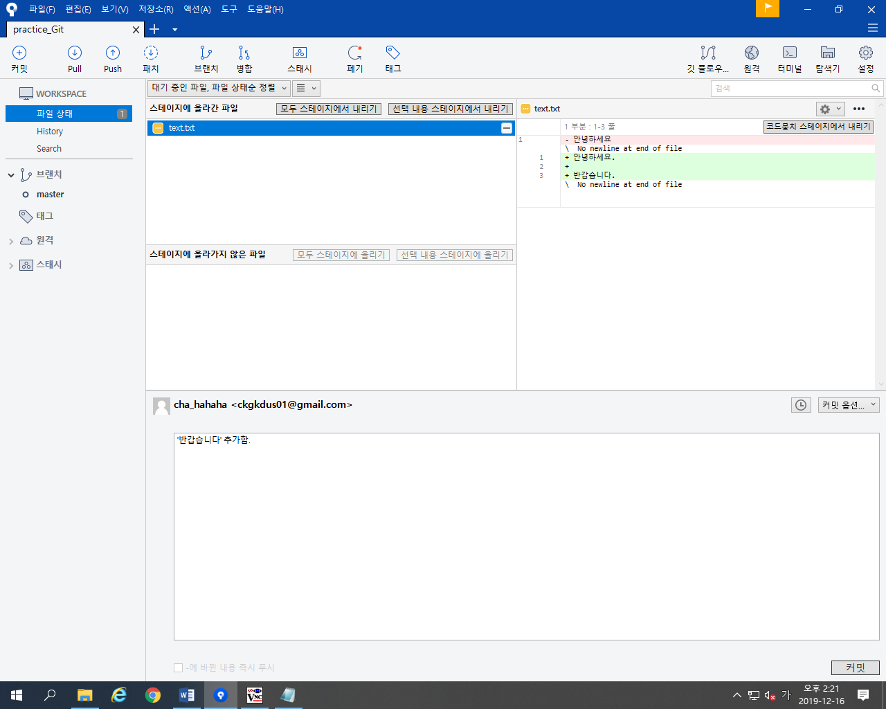
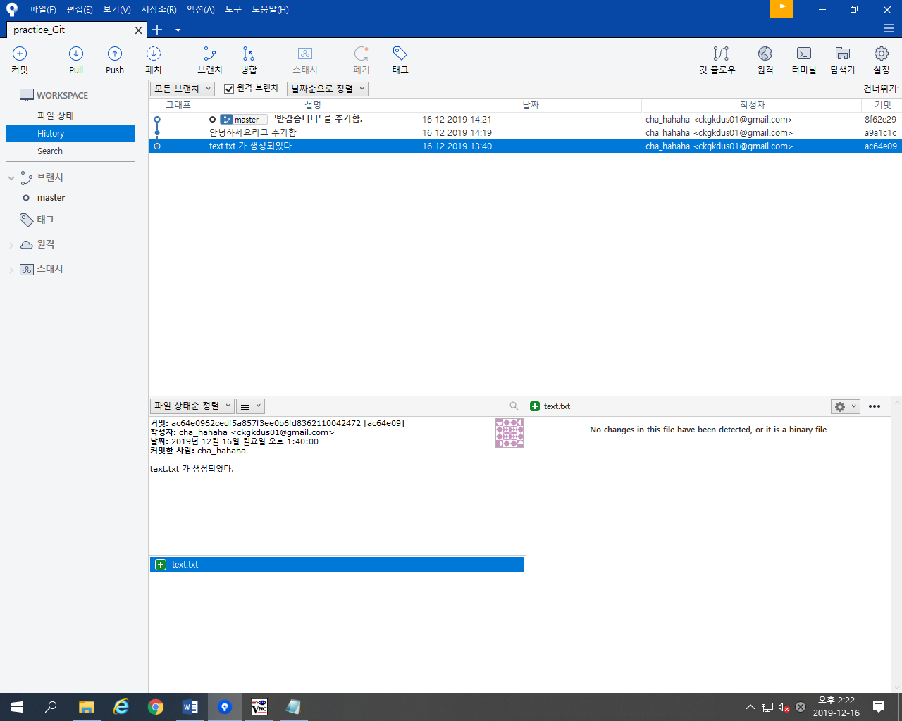
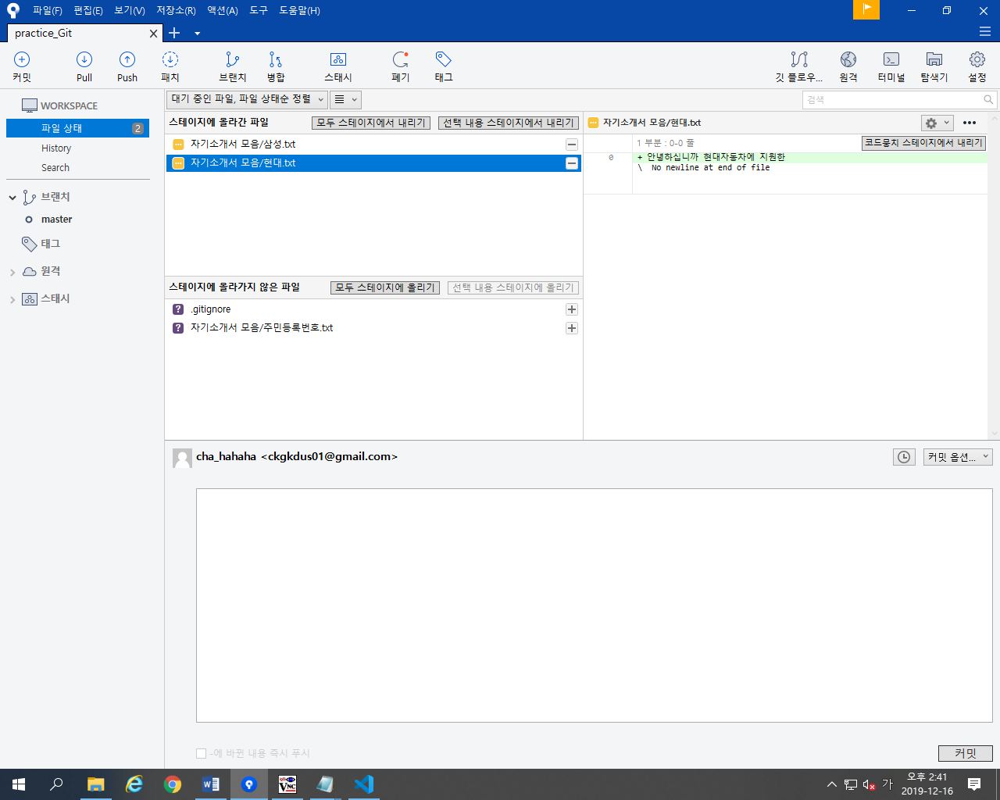
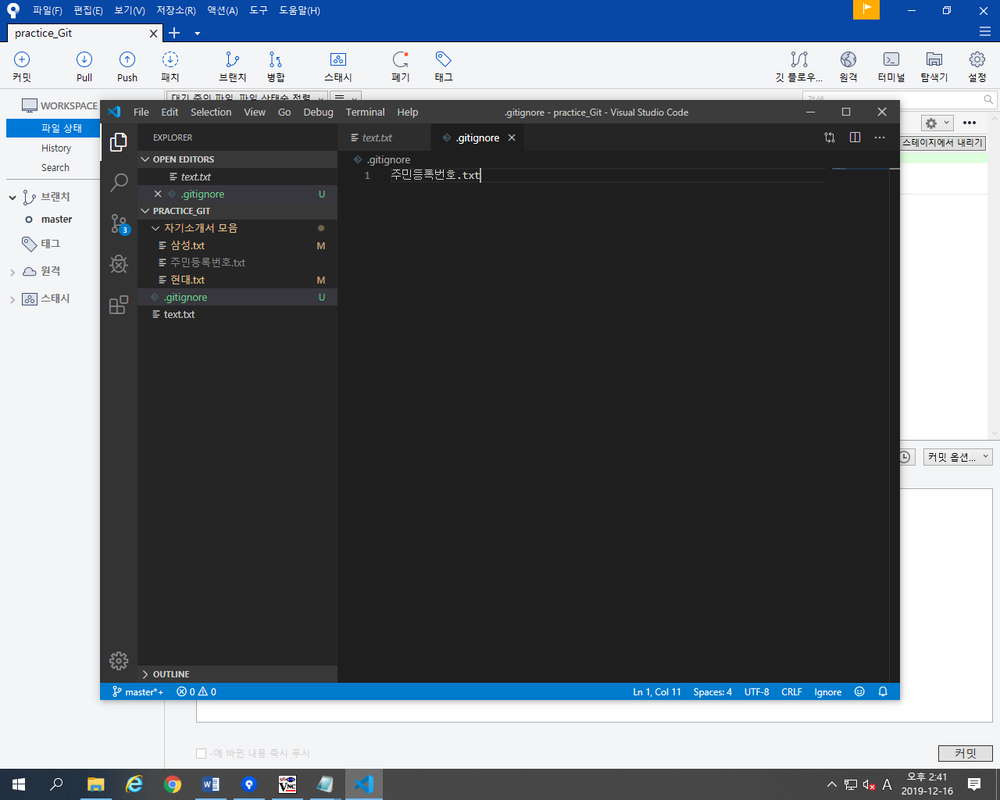
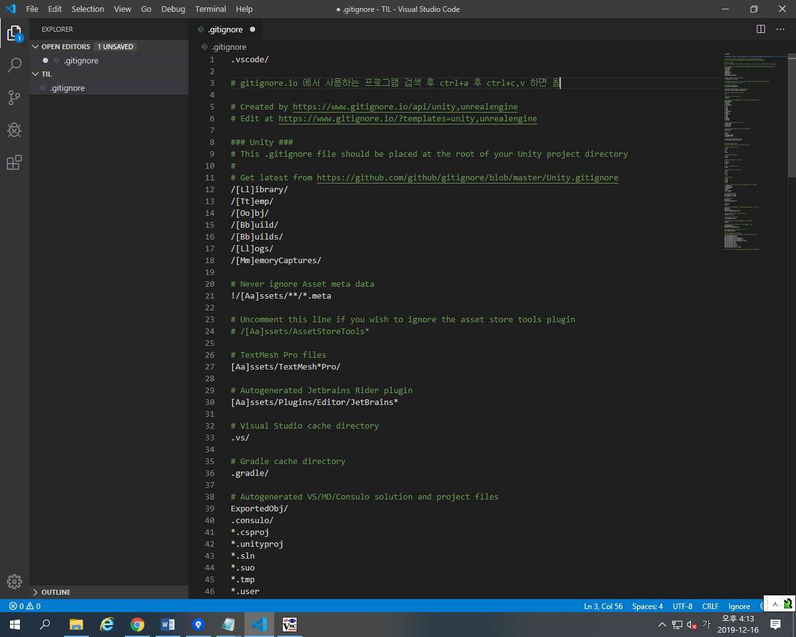
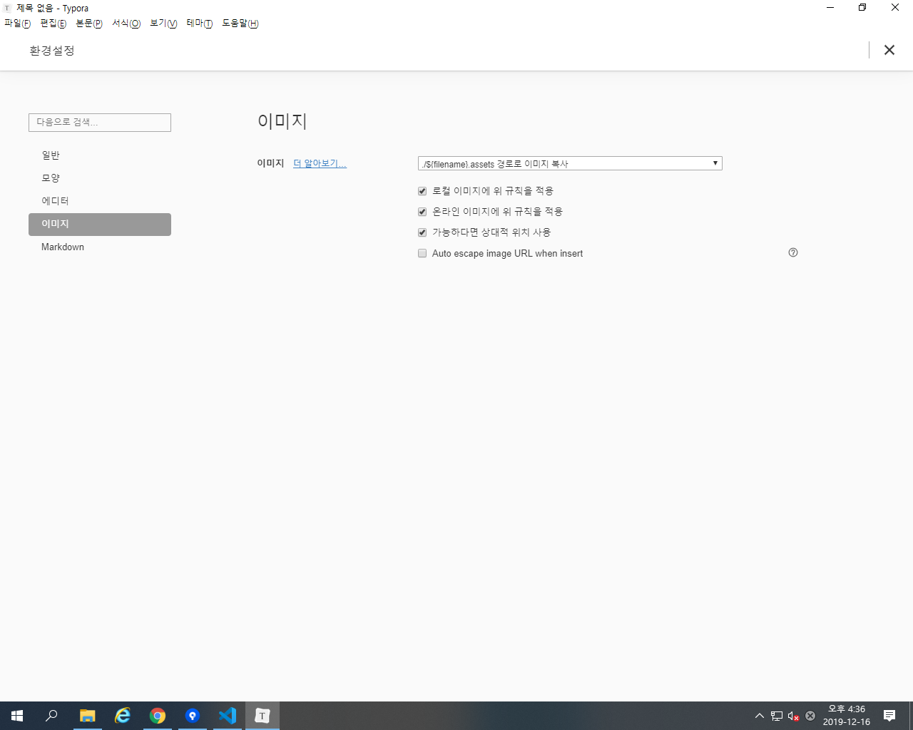

# Git 기초

## 개념

### SCM 이란?

Source Code Manager 의 약자로 코듸으 ㅣ버젼을 관리하기 위해 존재한다

### GIT

git은 Linus Torvalds가 만든 SCM으로 현재 가장 많이 사용된다.

### Github

Github은 git이 관리하는 Repo의 원격 저장소를 제공하는 서비스다. 가장 많이 사용하며 오픈소스 프로젝트들이  성장하는 곳이다. 최근 MS에서 인수했다.

## Sourcetree

Github의 로컬과 리뮤트를 연결하여 푸시 및 프로젝트를 관리하기 쉽게 한다.

1. 기본적으로 Repo 중인 파일은 unstage 상태에 있다. 하지만 이것을 커밋하기 위해 stage로 올린 후, 아래 추가 설명을 하여 업데이트간 구분을 한다.

2. 1번의 커밋을 누르게 되면, History 창으로 접속이 가능해진다. 

   

3. 추가로 Repo가 된 폴더에 자료를 추가하게 되면 감시상태에 있기때문에 unstage 상황에 있다. 하지만 내가 stage로 올리지 않으면 보고는 있지만 활동 내역에 대해 아무런 반응을 하지 않는다.

   

4. Repo를 하기 전, 가장 중요한 단계라고 강사님이 설명해주셨다. Repo를 설정하기 전, 비주얼스튜디어코드에 접속하여 .gitignore을 생성한다. 그 후, 

5. 그 후, gitignore.io에 접속하여 무시해도 되는 엔진 코드를 복붙하면 된다.

6. github를 작성할 시 손쉽게 사용하기 위해 Typora를 다운로드 한다. 그 후, 설정의 이미지를 저 상태로 설정한다. 