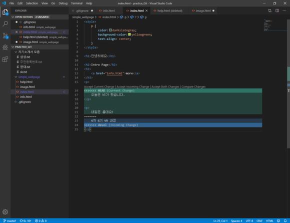

# Git 중급

## Clone

git remote clone 은 다운로드가 아니라 clone을 해야한다. 그 후 Pull을 사용하여 자료 연동하기

가령, 집이나 회사에서 작업을 한 후, Add Commit Push 3단계를 했다. 그 후, 다른 장소를 이동하고 업데이트된 자료에 추가 수정을 위해 Pull 활용

1. pull하기 위한 순서

\- 클론(linking) 만들기 (download zip할 때, .git이 없어져 다시 카메라를 설치해도 다른 파일되기 때문)

\- 로컬에서 push를 통해 remote 와 씽크를 맞춘다

\- 집 도착 후 pull한 후에 작업

\- 자기 전에 add commit push 3단계 진행 

\- 회사 컴퓨터로 Pull

.

.

.

.(무한 루프)

2. 상대방과 github 사용하기

콜라보레이터에 상대방 아이디 초대 후 메일로 승낙하면 쪼인됨

3. 충돌시나리오(conflict)

\- 상대방과 서로 파일을 올리려고 하면 github와 사진개수 차이로 인해 늦게 Push를 한 사람이 pull을 한 후에 push 가능 (conflict 시나리오 1)

\- 파일은 하나인데 둘이서 다른 아이디어를 통해 다른 작업시 (conflict 시나리오2)

→비주얼 스튜디오 코드에서 push하는 입장에서 둘 중 하나 받아들인 후 푸시하면 충돌 끝(수동으로 해결해야한다는 것이 핵심!)

시나리오 2에 해당하는 충돌, 한가지 파일에 수정안이 다르다면 발생(둘 중 하나를 고르던지, 아니면 전체적인 수정으로 충돌해결)

4. Master = Branch(?)

\- 근본(나무기둥)에서 복사본(branch)으로 빠져나오다가 수정 다끝나면 Merge(병합)

\- Pull은 계속 해도 되나 Push같은 경우는 고민 끝에 할 것(like 최종보고서 제출)

\- Master는 당장 출시해도 문제 없는 제품을 의미하기도 함

\* 복구하기

1) Branch는 망했을 시 끊어서 다시 돌아갈 수 있는 가장 좋은 방법(마스터는 꽃길만,,)

2) 체크아웃은 내가 설정해서 편집할 브랜치 혹은 마스터

Or History에서 커밋하기 전이라면 체크아웃 기능을 통해 가고싶은 과거로 이동

3) 과거로 가서 코드만 복사 후 그대로 다시 돌아오기(단! 절대 커밋누르거나 어떠한 저장하면 안된다)